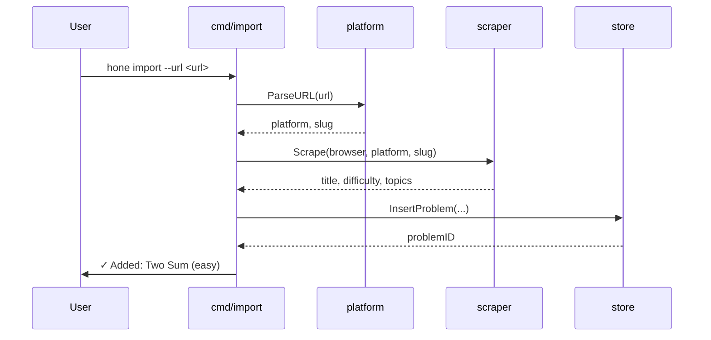
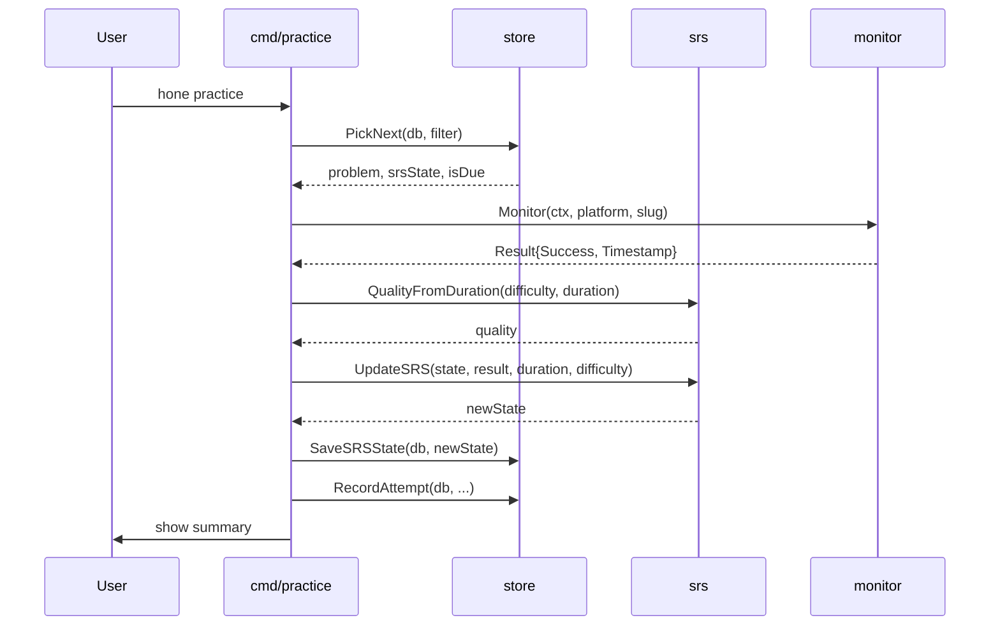

# Architecture

## Package map

```
hone/
├── cmd/                  Cobra commands (thin wiring layer)
│   ├── root.go           PersistentPreRunE: config.Init + db.Open
│   ├── practice.go       hone practice
│   ├── import.go         hone import [--playlist|--backup|--url] (wizard if no flags)
│   ├── export.go         hone export [--backup|--playlist] (wizard if no flags)
│   └── playlist.go       hone playlist create|list|select
│
├── internal/
│   ├── config/           Viper config init, BuildURL, threshold accessors
│   ├── db/               sqlx open + goose migrations (embedded SQL)
│   ├── platform/         URL parsing (ParseURL)
│   ├── srs/              Pure SM-2 logic (UpdateEF, UpdateSRS, QualityFromDuration)
│   ├── store/            All DB queries (PickNext, InsertProblem, SaveSRSState…)
│   ├── scraper/          Headless scraping via external Chrome + Rod (title, difficulty, topics)
│   ├── monitor/          Headful Rod browser monitor (submission result detection)
│   ├── importer/         Playlist-format file parser (ParseImportFile)
│   ├── backup/           Export + restore (ExportFullBackup, ExportSinglePlaylistFormat, RestoreFromBackup)
│   └── tui/              All Bubble Tea models
│       ├── import_wizard.go   Guided import wizard (list → filepicker/textinput → delegate)
│       └── export_wizard.go   Guided export wizard (list → playlist picker → destination)
│
└── docs/                 This documentation
```

---

## Data flow

### Adding a problem



### Practice session



---

## Key design decisions

### `srs` vs `store` separation

`internal/srs/` contains only pure functions (SM-2 math, quality mapping, state transitions) — no DB, no config dependencies. `internal/store/` has all DB queries and imports `srs` for types.

The wiring: commands call `store` to fetch data, pass to `srs` for computation, call `store` again to persist. Changing the algorithm only touches `srs`; changing the DB schema only touches `store`.

### TUI via router stack

Navigation is a stack of `tea.Model` values managed by `internal/tui/router.go`. Push a new model with `PushMsg{Model: m}`; pop back with the `Pop()` command helper. This lets any model navigate to any other without hardcoded parent/child relationships.

### `colorTable` instead of `bubbles/table`

`bubbles/table` v1.0.0 uses `runewidth.Truncate()` which doesn't understand ANSI escape sequences — it counts escape bytes as visible characters, causing column misalignment when cells contain lipgloss styles. `internal/tui/color_table.go` replaces it with a table that uses `lipgloss.Width()` for all width calculations.

### No CGO

`modernc.org/sqlite` provides a pure-Go SQLite driver, so `hone` cross-compiles cleanly without a C toolchain. The GoReleaser build produces static macOS binaries.

---

## Database schema

```sql
problems        -- id, platform, slug, title, difficulty, created_at
topics          -- id, name
problem_topics  -- problem_id, topic_id (many-to-many)
playlists       -- id, name, created_at
playlist_problems -- playlist_id, problem_id, position (many-to-many, ordered)
attempts        -- id, problem_id, started_at, completed_at, result, duration_seconds, quality
problem_srs     -- problem_id, easiness_factor, interval_days, repetition_count, next_review_date, mastered_before
settings        -- single-row: active_playlist_id (FK), active_topic_id (FK)
```

A database trigger `trg_init_problem_srs` automatically inserts a default `problem_srs` row whenever a problem is inserted. This guarantees every problem has SRS state and simplifies all query paths.
